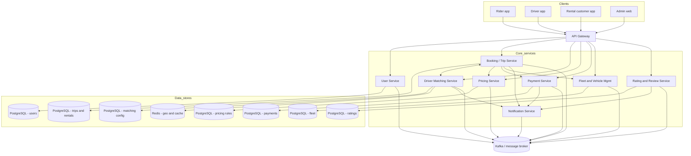

# RideFlex — High-level architecture

RideFlex clients include **rider** and **driver** mobile applications, a **rental customer** app (could be a mode inside the rider app in some deployments), and **admin/ops** web consoles. Traffic enters through a regional **API gateway** that terminates TLS, validates tokens with the **User Service** (or shared IdP), applies rate limits, and routes to microservices. Core business operations persist primarily in **PostgreSQL** per service (database-per-service pattern). A **Kafka** cluster carries domain events for choreography between services. **Redis** supports geo queries, hot configuration, and ephemeral matching state.

## System narrative

1. Mobile and web clients call the gateway over HTTPS.
2. The gateway forwards REST-style requests to domain services; most responses are synchronous.
3. On state changes (e.g., trip requested, driver assigned), services publish events to Kafka.
4. Downstream consumers (Notification, analytics adapters, search indexers) react without blocking the user path.
5. Each owning service writes to its **primary PostgreSQL** database; cross-service queries go through APIs, not shared tables.

Operational deployment is assumed to be **Kubernetes** per region, with horizontal pod autoscaling on Matching and Pricing read paths. Details appear in `08-tech-stack.md`.

---

## System context diagram (logical connectivity)

The flowchart below is **logical** (not every network hop or sidecar is shown). Solid arrows imply primary request/response paths; the broker implies publish/subscribe fan-out.

## Design notes for onboarding

- **Gateway thickness**: Business rules belong in services, not the gateway, so gateway replacements remain low-risk.
- **Broker as backbone**: Kafka topics are named by domain (`rideflex.trip.*`, `rideflex.rental.*`) in implementation guides not included here.
- **Failure isolation**: If Notification lags, core booking still completes; user-visible delay may occur on auxiliary channels only.

This document pairs with `06-low-level-architecture.md` for two-service drill-downs and with `07-flows.md` for sequence-level behavior.
