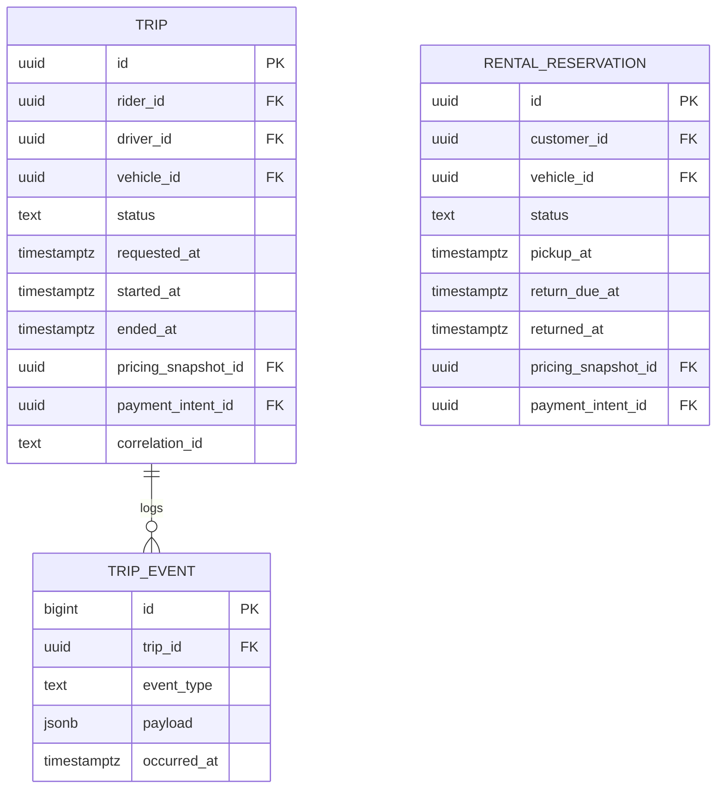
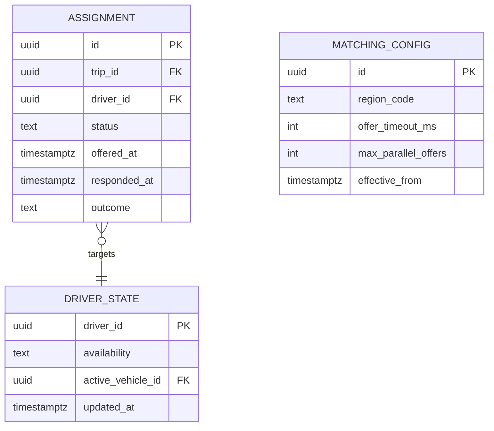
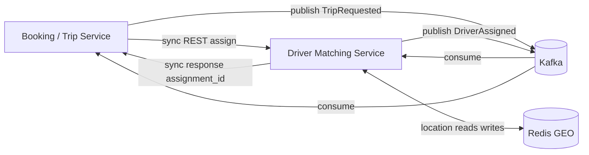

# RideFlex — Low-level architecture (selected modules)

This document zooms into **Booking / Trip Service** and **Driver Matching Service**: internal components, representative persistence, and **sync vs async** integration patterns. All schema fields are **illustrative** for ER diagrams in Markdown viewers.

---

## Booking / Trip Service

### Internal components

| Component | Purpose |
|-----------|---------|
| **Trip API** | REST handlers for create, cancel, status, and driver-visible transitions. |
| **Rental API** | Reservation create/modify/return; coordinates with Fleet for locks. |
| **State engine** | Deterministic state machines for `TRIP` and `RENTAL` aggregates with guard conditions. |
| **Pricing adapter** | Calls Pricing for quotes; stores `pricing_snapshot_id` on commit. |
| **Payment adapter** | Creates payment intents, listens for capture/refund outcomes (sync + event). |
| **Event publisher** | Emits domain events after successful commits (outbox pattern assumed). |
| **Projection builder** | Maintains read models for mobile status polling (optional CQRS-lite). |

### Sync vs async

- **Synchronous REST**: Create trip → validate user → request assignment from Matching (or enqueue if async variant) → return booking confirmation; Pricing quote fetch inline.
- **Asynchronous events**: `TripCompleted` → Notification, Rating eligibility, analytics; `RentalHandoffCompleted` → Fleet telematics correlation (fictional).

### Representative ER diagram (trips and rentals)

---

## Driver Matching Service

### Internal components

| Component | Purpose |
|-----------|---------|
| **Demand ingress** | Consumes `TripRequested` or receives synchronous assignment RPC from Booking. |
| **Geo index service** | Maintains driver locations in Redis GEO structures per cell/region. |
| **Scorer** | Ranks candidates by distance, ETA, driver tier, fairness rotation, and vehicle match. |
| **Offer manager** | Creates time-boxed offers, tracks accept/decline/timeout. |
| **Reassignment loop** | On failure, re-queries with relaxed constraints up to policy limits. |
| **Policy hooks** | Pluggable rules (fictional) for max concurrent offers per driver. |

### Sync vs async

- **Synchronous**: Booking may call `POST /matching/assign` for low-latency path; response includes `assignment_id` or structured no-supply.
- **Asynchronous**: `DriverLocationUpdated` events from driver apps (via gateway ingestion service not detailed here) stream into Kafka; Matching consumers update Redis. `DriverAssigned` and `AssignmentFailed` published for Booking and Notification.

### Representative ER diagram (matching persistence)

PostgreSQL holds **durable** assignment records and audit; Redis holds **ephemeral** offer TTLs (not shown as ER).

---

## Cross-service communication summary

## Operational cautions (demo)

Matching is **latency-sensitive**; protect Redis with tiered memory policies and backpressure on location write volume. Booking prioritizes **correctness** of money and state; prefer transactional outbox when emitting payment-related events.
