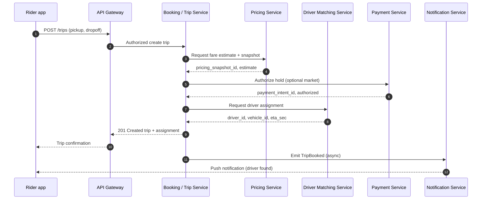
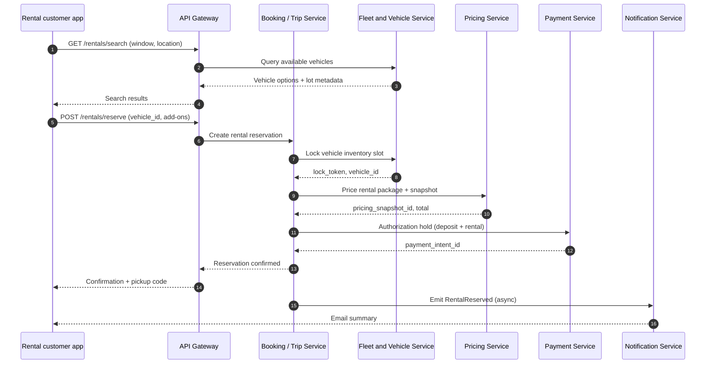
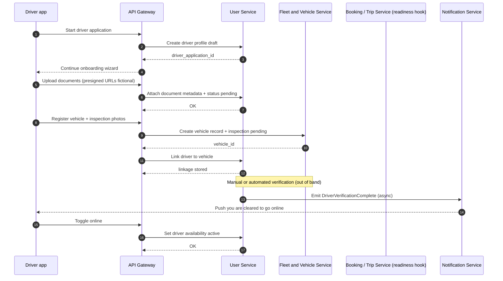
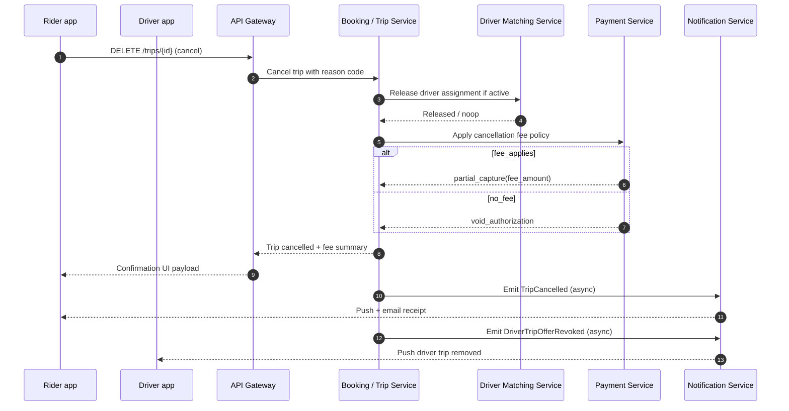

# RideFlex — Key end-to-end flows

The following **Mermaid sequence diagrams** describe representative interactions. Actors and steps are simplified for readability; retries, idempotency keys, and id_token propagation are omitted unless noted.

---

## 1. Ride booking flow (happy path)

**Narrative**: The rider receives a fare anchored to a **pricing snapshot** before the trip is materially committed. Matching returns an assignable driver under nominal supply. Notification confirms asynchronously so a slow SMS provider does not block the HTTP response.

---

## 2. Car rental booking flow

**Narrative**: Inventory **locking** prevents double booking of the same physical unit. Deposit handling is modeled as payment authorization; capture timing follows rental lifecycle events not shown here.

---

## 3. Driver onboarding flow

**Narrative**: User Service remains the **identity and eligibility** anchor; Fleet owns **inspection state** for the physical asset. Booking service may subscribe to activation events to warm caches—shown only as conceptual “readiness” in this diagram.

---

## 4. Payment and cancellation flow

This flow combines **rider-initiated cancellation** after assignment with payment side effects. Amounts are illustrative.

**Narrative**: Cancellation is a **coordination** problem: release constrained supply (driver offer) and align money movement with policy. Driver notification may be direct through Notification templates keyed by `trip_id` and `driver_id`.

---

## How to use these flows in onboarding

- Map each arrow to **observability** exercises: which `correlation_id` appears across BT, PY, and NS logs.
- Extend with **failure swimlanes** (matching timeout, payment decline) as a learner exercise—keep fictional outcomes explicit in any appended material.
